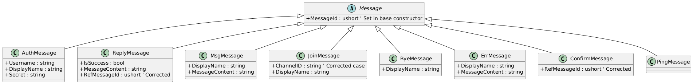
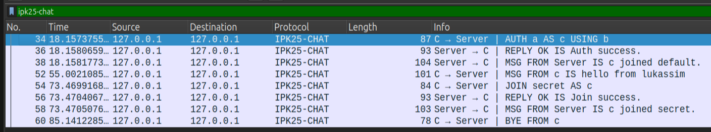
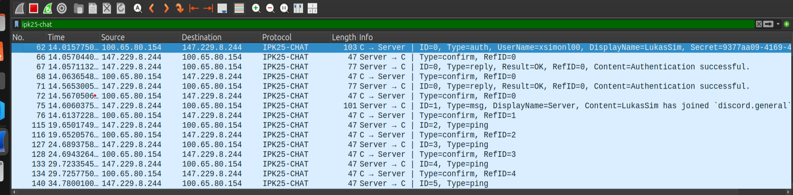
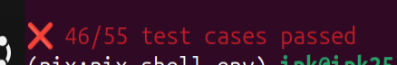

# IPK projekt 2 - chat client IPK25-CHAT

  

## Obsah

  

* [Využitie umelej inteligencie](#využitie-umelej-inteligencie)

* [Cieľ projektu](#cieľ-projektu)

* [Teoretické východiská](#teoretické-východiská)

* [Implementácia](#implementácia)

* [Zdrojové súbory](#zdrojové-súbory)

* [Testovanie](#testovanie)

* [Zdroje](#zdroje)

  

## Využitie umelej inteligencie

  

V zdrojovom kóde bola umelá inteligencia využitá na refactoring kódu a pridanie komentárov.

V dokumentácii bola využitá na vytvorenie Class diagramu dedičnosti na základe mojich zdrojových súborov, a taktiež na prepis mnou napísaného textu v MS Word do .md syntaxe.

  

## Cieľ projektu

Cieľom bolo vytvoriť chatovacieho klienta, ktorý bude môcť komunikovať so serverom na základe protokolu `IPK25-CHAT` pomocou protokolov TCP a UDP. Výsledkom je že sa pomocou klienta môžeme pripojiť na discord server a písať si správy s otatnými študentmi.

  

## Teoretické východiská

  

#### TCP vs UDP

  

TCP je protokol orientovaný na pripojenie, zatiaľ čo UDP je protokol bez pripojenia.[1]

V TCP variante sa môj klient najskôr pripája na server pomocou TcpClient za použitia 3-way handshake, zatiaľ čo v UDP je prvá interakcia so serverom až `AUTH` správa.

  

TCP má potvrdzovacie segmenty, ale UDP nemá žiadne potvrdzovacie segmenty.[1]

V praxi to znamená že v UDP variante sme museli implementovať napr. potvrdzovanie správ či evidovanie už spracovaných správ.

  

#### Použitie asynchrónnych funkcii

Pre správne fungovanie aplikácie bolo potrebné niektoré funkcie implementovať ako asynchrónne, čo v praxi znamená, že aplikácia dokáže zachytiť prichádzajúcu správu na inom vlákne, napr. počas zadávania vstupu od užívateľa. [3]

  
  
  

## Implementácia

  

### Dedičnosť

  

Základným prvkom je dedičnosť, ktorá bola použitá ako pre objekty správ, tak pre vlastnosti, ktoré majú spoločné TCP aj UDP. Na obrázku je Class Diagram zobrazujúci dedičnosť správ.

  



  
  

### Zdrojové súbory

  

#### Program

  

Je štartovacím bodom celej aplikácie, je zodpovedný za spracovanie vstupných argumentov a vytvorenie objektu `TcpChatClient` alebo `UdpChatClient`.

  

#### Message

  

Toto je hlavná rodičovská trieda, z ktorej dedia všetky typy správ. Obsahuje abstraktný typ `MessageType`, ktorý si každá odvodená trieda nastaví podľa typu správy, ktorý reprezentuje.

  

Ďalej táto trieda obsahuje predpisy dvoch metód `GetBytesInTcpGrammar` a `GetBytesForUdpPacket`, ktoré sú zodpovedné za získanie správneho obsahu pre poslanie, ktorý obsahuje atribúty definované na danej správe, ako je napr. `MessageContent` či `Displayname`. Tieto metódy si každá trieda voliteľne implementuje podľa potreby, kedže nie všetky typy správ sa používajú v oboch protokoloch.

  

Ďalej táto základná trieda obsahuje dva typy konštruktorov, s a bez použitia `messageId`. Každý sa používa v inom protokole.

  

Nakoniec trieda message obsahuje ešte validačné metódy, ktoré kontrolujú užívateľský vstup.

  

#### Odvodené triedy od triedy Message:

  

* AuthMessage

* ByeMessage

* ErrMessage

* JoinMessage

* MsgMessage

* PingMessage

* ConfrimMessage

* ReplyAuthMessage (používa sa aj pri odpovedi na správu Join)

  

#### ChatClient

  

Táto trieda zastupuje vlastnosti ktoré sú rovnaké pre oba protokoly, ako sú port, cieľový server, a aktuálny stav podľa FSM v ktorom sa klient aktuálne nachádza. V tomto súbore je definovaný zoznam všetkých možných stavov klienta podľa FSM.

  

#### TcpChatClient

  

Metóda `Start` je vstupným bodom, nachádza sa v nej logika FSM, a podľa užívateľského vstupu vytvorenie príslušných správ v pomocných funkciách.

  

Na začiatku sa zavolá metóda `ConnectAsync` a spustí sa príjimacia slučka.

  

Metóda `ProcessMessageAsync` potom odošle príslušnú správu volaním funkcie `SendPalyoadAsync` ktorá ako parameter bere už byty danej správy.

  

Prichádzajúce správy spracúva funkcia `ReceiveLoopAsync`, ktorá predá prichádzajúcu správu parseru. Prijatá správa je potom vypísaná pomocou `ToString()` metódy volanej na vytvorenom objekte danej správy.

  

#### UdpChatClient

  

Má podobnú logiku ako TCP, samozrejme s pridaním vlastností špecifických pre UDP.

  

Miesto metódy `ConnectAsync` je tu metóda `InitializeSocket`.

  

Slovník `_pendingConfirmationMessages` kde kľúč je `MessageId` drží informácie o správach aktuálne čakajúcich na potvrdenie. Ako hodnotu obsahuje objekt `SentMessageInfo`, kde je uložená správa ktorá bola poslaná pod týmto ID, a umožňuje tak jednoduché znovupreposlanie.

  

List unikátných IDs `_pendingConfirmationMessages` zase uchováva informácie o správach, ktoré už boli spracované, pre vyhnutie sa duplicitnému spracovaniu rovnakej správy.

  

Prijímacia slučka `ReceiveLoopAsync` posiela CONFIRM ešte pred spracovaním správy parserom, zároveň kontroluje či daná správa už nebola spracovaná.

  

#### TcpMessageParser / UdpMessageParser

  

Tieto statické triedy obsahuju metódy na načítanie užívateľského vstupu a následne vytvorenie príslušného objektu správy a tiež metódy na parsing prichádzajucich správ.

  

## Testovanie

Počas vývoja som projekt testoval pomocou lokálnych serverov vytvorených v pythone pomocou umelej inteligencie. V repozitári su priložené oba skripty, pre TCP  aj UDP. Vo výpisoch sú ponechané ladiace hlášky, pomocou ktorých som overoval funkčnosť projektu a ktoré boli nápomocné pri ladení a opravovaní chýb.

### TCP localhost
Ukážka TCP autentifikácie, príkazu /join, poslanie správy a ukončenie spojenia (SIGINT) s následným poslaním BYE mesage.
 '''text

(nix:nix-shell-env) ipk@ipk25:~/proj/proj2-ipk25-chat/src$ dotnet run -t tcp -s localhost

Debug: Connecting to 127.0.0.1:4567 via TCP...

Debug: Connected successfully

/auth a b c

Debug: Changing state to Auth

Debug: Processing message in state Auth

Debug: Changing state to Auth

Debug: rawData: REPLY OK IS Auth success.

  

Action Success: Auth success.

  

Debug: Changing state to Open

Debug: rawData: MSG FROM Server IS c joined default.

  

Server: c joined default.

hello from lukassim

Debug: Msg message object created

Debug: Processing message in state Open

/join secret

Debug: Processing message in state Open

Debug: Changing state to Join

Debug: rawData: REPLY OK IS Join success.

  

Action Success: Join success.

  

Debug: Changing state to Open

Debug: rawData: MSG FROM Server IS c joined secret.

  

Server: c joined secret.

Disconnecting... Reason: Console cancel key press.

Debug: Changing state to End



### Udp localhost

Ukážka UDP autentifikácie, a následná práca so správami, ako je ich potvrdzovanie či pridanie do zoznamu už spracovaných správ.

'''text

(nix:nix-shell-env) ipk@ipk25:~/proj/proj2-ipk25-chat/src$ dotnet run -t udp -s localhost

Debug: Starting UDP Client (Timeout: 250ms, Retries: 3)

DEBUG: Socket initialized successfully.

DEBUG: Incrementing message ID. to 0

/auth a b c

DEBUG: Incrementing message ID. to 1

Debug: Received message from 127.0.0.1:4567

DEBUG: Received message with ID 0 and type CONFIRM

Debug: Received message type: CONFIRM

Debug: message with ID 0 was confirmed.

Debug: Received message from 127.0.0.1:60643

DEBUG: Received message with ID 0 and type REPLY

DEBUG: Sending confirmation for message ID 0

Debug: Received message type: REPLY

message with ID 0 and type REPLY added to already proccessed list

Action Success: Auth success.

  

Debug: Changing state to Open

Debug: Received message from 127.0.0.1:60643

DEBUG: Received message with ID 1 and type MSG

DEBUG: Sending confirmation for message ID 1

Debug: Received message type: MSG

message with ID 1 and type MSG added to already proccessed list

Server: c joined default.

Debug: Received message from 127.0.0.1:60643

DEBUG: Received message with ID 2 and type PING

DEBUG: Sending confirmation for message ID 2

Debug: Received message type: PING

message with ID 2 and type PING added to already proccessed list

Debug: Received message from 127.0.0.1:60643

DEBUG: Received message with ID 3 and type PING

DEBUG: Sending confirmation for message ID 3

Debug: Received message type: PING

message with ID 3 and type PING added to already proccessed list

DEBUG: Incrementing message ID. to 2


### Testovanie na serveri anton5.fit.vutbr.cz

Funkčnosť som overil aj na serveri anton5.fit.vutbr.cz, nižšie je ilustrácia funkčnosti spolu s ladiacimi hláškami pre oba protokoly.

  

#### TCP variant

  

```text

(nix:nix-shell-env) ipk@ipk25:~/proj/proj2-ipk25-chat$ ./ipk25chat-client -t tcp -s anton5.fit.vutbr.cz

Debug: Connecting to 147.229.8.244:4567 via TCP...

Debug: Connected successfully

/auth xsimonl00 [token] LukasSim

Debug: Changing state to Auth

Debug: Processing message in state Auth

Debug: Changing state to Auth

Debug: rawData: REPLY OK IS Authentication successful.

  

Action Success: Authentication successful.

  

Debug: Changing state to Open

Debug: rawData: MSG FROM Server IS LukasSim has joined `discord.general` via TCP.

  

Server: LukasSim has joined `discord.general` via TCP.

hello

Debug: Msg message object created

Debug: Processing message in state Open

Debug: rawData: MSG FROM sometest IS mfasf

sometest: mfasf

```

Zobrazenie potvrdenia autentifikácie a potvrdzovania ping správ pri UDP

  




  

### UDP variant

  

```text

(nix:nix-shell-env) ipk@ipk25:~/proj/proj2-ipk25-chat$ ./ipk25chat-client -t udp -s anton5.fit.vutbr.cz

Debug: Starting UDP Client (Timeout: 250ms, Retries: 3)

DEBUG: Socket initialized successfully.

/auth xsimonl00 [token] LukasSim

Debug: Received message type: CONFIRM

Debug: message with ID 0 was confirmed.

Debug: Received message type: REPLY

message with ID 0 and type REPLY added to already proccessed list

Action Success: Authentication successful.

  

Debug: Changing state to Open

Debug: Received message type: REPLY

message with ID 0 and type REPLY added to already proccessed list

Action Success: Authentication successful.

  

Debug: Changing state to Open

Debug: Received message type: MSG

message with ID 1 and type MSG added to already proccessed list

Server: LukasSim has joined `discord.general` via UDP.

Debug: Received message type: MSG

message with ID 2 and type MSG added to already proccessed list


Ako doplnok som celkovú funkčnosť implementácie na záver overoval pomocou komplexných testov vytvorených inými študentami, s ich súhlasom na použtie. [2] Problém pri neuspešných testoch je spomenutý v súbore CHANGELOG.

  
 
 

```

  


## Zdroje

  

[1] Rozdíly mezi TCP a UDP. Dostupné na: [https://www.guru99.com/cs/differences-between-tcp-and-udp.html](https://www.guru99.com/cs/differences-between-tcp-and-udp.html)

  

[2] MALASHCHUK Vladyslav, Tomáš HOBZA, et al. VUT_IPK_CLIENT_TESTS [online]. GitHub, 2025 [cit. 2025-04-16]. Dostupné na: [https://github.com/Vlad6422/VUT_IPK_CLIENT_TESTS](https://github.com/Vlad6422/VUT_IPK_CLIENT_TESTS)

  

[3] Asynchronous programming with async and await. Dostupné na: [https://learn.microsoft.com/en-us/dotnet/csharp/asynchronous-programming/](https://learn.microsoft.com/en-us/dotnet/csharp/asynchronous-programming/)

  

[RFC2119] Bradner, S. _Key words for use in RFCs to Indicate Requirement Levels_ [online]. March 1997. [cited 2024-02-11]. DOI: 10.17487/RFC2119. Available at: [https://datatracker.ietf.org/doc/html/rfc2119](https://datatracker.ietf.org/doc/html/rfc2119)

  

[RFC5234] Crocker, D. and Overell, P. _Augmented BNF for Syntax Specifications: ABNF_ [online]. January 2008. [cited 2024-02-11]. DOI: 10.17487/RFC5234. Available at: [https://datatracker.ietf.org/doc/html/rfc5234](https://datatracker.ietf.org/doc/html/rfc5234)

  

[RFC9293] Eddy, W. _Transmission Control Protocol (TCP)_ [online]. August 2022. [cited 2024-02-11]. DOI: 10.17487/RFC9293. Available at: [https://datatracker.ietf.org/doc/html/rfc9293](https://datatracker.ietf.org/doc/html/rfc9293)

  

[RFC894] Hornig, C. _A Standard for the Transmission of IP Datagrams over Ethernet Networks_ [online]. April 1984. [cited 2024-02-14]. DOI: 10.17487/RFC894. Available at: [https://datatracker.ietf.org/doc/html/rfc894](https://datatracker.ietf.org/doc/html/rfc894)

  

[RFC791] Information Sciences Institute, University of Southern California. _Internet Protocol_ [online]. September 1981. [cited 2024-02-14]. DOI: 10.17487/RFC791. Available at: [https://datatracker.ietf.org/doc/html/rfc791](https://datatracker.ietf.org/doc/html/rfc791)

  

[RFC768] Postel, J. _User Datagram Protocol_ [online]. March 1997. [cited 2024-02-11]. DOI: 10.17487/RFC0768. Available at: [https://datatracker.ietf.org/doc/html/rfc768](https://datatracker.ietf.org/doc/html/rfc768)

  

[RFC1350] Sollins, D. _The TFTP Protocol (Revision 2)_ [online]. July 1992. [cited 2024-02-12]. DOI: 10.17487/RFC1350. Available at: [https://datatracker.ietf.org/doc/html/rfc1350](https://datatracker.ietf.org/doc/html/rfc1350)

  

[RFC1945] NIELSEN, Henrik, Roy T FIELDING a Tim BERNERS-LEE, 2022. _Hypertext Transfer Protocol -- HTTP/1.0_ [online]. May 1996. [cited 2025-01-23]. Available at: [https://datatracker.ietf.org/doc/html/rfc1945](https://datatracker.ietf.org/doc/html/rfc1945)
