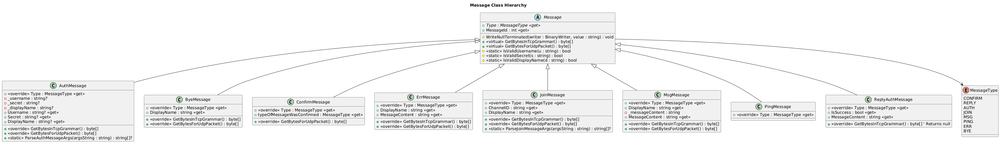

# IPK project 2

## Obsah

* Využitie umelej inteligencie
* Implementácia
* Zdrojové súbory
* Testovanie
* Ilustračná fukcionalita
* Zdroje




## Implementácia

### Zdrojové súbory

#### ArgsParser

#### Program

[source: 1] Je štartovacím bodom celej aplikácie, je zodpovedný za spracovanie vstupných argumentov a vytvorenie objektu TcpClient alebo UdpClient.

#### Message

[source: 2] Toto je hlavná rodičovská trieda, z ktorej dedia všetky typy správ. [source: 3] Obsahuje abstraktný typ `MessageType`, ktorý si každá odvodená trieda nastaví podľa typu správy, ktorý reprezentuje.

[source: 4] Ďalej táto trieda obsahuje predpisy dvoch metód `GetBytesInTcpGrammar` a `GetBytesForUdpPacket`, ktoré sú zodpovedné za navrátenie správneho obsahu pre poslanie, ktorý obsahuje atribúty definované na danej správe, ako je napr. [source: 5] `MessageContent` či `Displayname`. Tieto metódy si každá trieda voliteľne implementuje podľa potreby, kedže nie všetky typy správ sa používajú v oboch protokoloch.

[source: 6] Ďalej táto základná trieda obsahuje dva typy konštruktorov, s a bez použitia `messageId`. Každý sa používa v inom protokole.

[source: 7] Na koniec trieda message obsahuje ešte validačné metódy, ktoré kontrolujú užívateľský vstup.

[source: 8] **Odvodené triedy od triedy Message:**

* AuthMessage
* ByeMessage
* ErrMessage
* JoinMessage
* MsgMessage
* PingMessage
* ConfrimMessage
* ReplyAuthMessage (používa sa aj pri odpovedi na správu Join)

#### ChatClient

Táto trieda zastupuje vlastnosti ktoré sú rovnaké pre oba protokoly, ako sú port, cieľový server, aktuálny stav podľa FSM v ktorom sa klient aktuálne nachádza. [source: 9] V tomto súbore je definovaný zoznam všetkých možných stavov klienta podľa FSM.

#### TcpChatClient

[source: 10] Metóda `Start` je vstupným bodom, nachádza sa v nej logika FSM, a podľa užívateľského vstupu vytvorenie príslušných správ v pomocných funkciách.

[source: 11] Na začiatku sa zavolá metóda `ConnectAsync` a spustí sa príjimacia slučka.

[source: 12] Metóda `ProcessMessageAsync` potom odošle príslušnú správu volaním funkcie `SendPalyoadAsync` ktorá ako parameter bere už byty danej správy.

[source: 13] Prichádzajúce správy spracúva funkcia `ReceiveLoopAsync`, ktorá predá prichádzajúcu správu parseru. [source: 14] Prijatá správa je potom vypísaná pomocou `ToString()` metódy volanej na vytvorenom objekte danej správy.

#### UdpChatClient

Má podobnú logiku ako TCP.

[source: 15] Miesto metódy `ConnectAsync` je tu metóda `InitializeSocket`.

Slovník `_pendingConfirmationMessages` kde kľúč je `MessageId` drží informácie o správach aktuálne čakajúcich na potvrdenie. [source: 16] Ako value obsahuje objek `SentMessageInfo`, kde je uložená správa ktorá bola poslaná pod týmto ID, a umožňuje tak jednoduché znovupreposlanie.

[source: 17] `HashSet _pendingConfirmationMessages` zase uchováva informácie o správach, ktoré už boli spracované, pre vyhnutie sa duplicitnému spracovaniu rovnakej správy.

[source: 18] Prijímacia slučka `ReceiveLoopAsync` posiela CONFIRM ešte pred spracovaním správy parserom, zároveň kontroluje či daná správa už nebola spracovaná.

#### SentMessageInfo

// todo

#### TcpMessageParser / UdpMessageParser

Statická trieda,

## Testovanie

Funkčnosť implementácie som overoval pomocou komplexných testov vytvorených inými študentami, s ich súhlasom na použtie. [3] Problém pri neuspešných testoch je spomenutý v súbore CHANGELOG.


Na záver som funkčnosť overil aj na serveri anton5.fit.vutbr.cz:

```text
(nix:nix-shell-env) ipk@ipk25:~/proj/proj2-ipk25-chat$ ./ipk25chat-client -t tcp -s anton5.fit.vutbr.cz
Debug: Connecting to 147.229.8.244:4567 via TCP...
Debug: Connected successfully
/auth xsimonl00 [token] LukasSim
Debug: Changing state to Auth
Debug: Processing message in state Auth
Debug: Changing state to Auth
Debug: rawData: REPLY OK IS Authentication successful.

Action Success: Authentication successful.

Debug: Changing state to Open
Debug: rawData: MSG FROM Server IS LukasSim has joined `discord.general` via TCP.

Server: LukasSim has joined `discord.general` via TCP.
hello
Debug: Msg message object created
Debug: Processing message in state Open
Debug: rawData: MSG FROM sometest IS mfasf

sometest: mfasf
```

Udp varianta

```text
(nix:nix-shell-env) ipk@ipk25:~/proj/proj2-ipk25-chat$ ./ipk25chat-client -t udp -s anton5.fit.vutbr.cz
Debug: Starting UDP Client (Timeout: 250ms, Retries: 3)
DEBUG: Socket initialized successfully.
/auth xsimonl00 9377aa09-4169-4f77-bdf4-36254eb538f8 LukasSim
Debug: Received message type: CONFIRM
Debug: message with ID 0 was confirmed.
Debug: Received message type: REPLY
message with ID 0 and type REPLY added to already proccessed list
Action Success: Authentication successful.

Debug: Changing state to Open
Debug: Received message type: REPLY
message with ID 0 and type REPLY added to already proccessed list
Action Success: Authentication successful.

Debug: Changing state to Open
Debug: Received message type: MSG
message with ID 1 and type MSG added to already proccessed list
Server: LukasSim has joined `discord.general` via UDP.
Debug: Received message type: MSG
message with ID 2 and type MSG added to already proccessed list
WOTkar01: jsem neco testoval
```


## Ilustračná fukcionalita

## Zdroje
//tu pridat zdroje


[RFC2119] Bradner, S. _Key words for use in RFCs to Indicate Requirement Levels_ [online]. March 1997. [cited 2024-02-11]. DOI: 10.17487/RFC2119. Available at: [https://datatracker.ietf.org/doc/html/rfc2119](https://datatracker.ietf.org/doc/html/rfc2119)

[RFC5234] Crocker, D. and Overell, P. _Augmented BNF for Syntax Specifications: ABNF_ [online]. January 2008. [cited 2024-02-11]. DOI: 10.17487/RFC5234. Available at: [https://datatracker.ietf.org/doc/html/rfc5234](https://datatracker.ietf.org/doc/html/rfc5234)

[RFC9293] Eddy, W. _Transmission Control Protocol (TCP)_ [online]. August 2022. [cited 2024-02-11]. DOI: 10.17487/RFC9293. Available at: [https://datatracker.ietf.org/doc/html/rfc9293](https://datatracker.ietf.org/doc/html/rfc9293)

[RFC894] Hornig, C. _A Standard for the Transmission of IP Datagrams over Ethernet Networks_ [online]. April 1984. [cited 2024-02-14]. DOI: 10.17487/RFC894. Available at: [https://datatracker.ietf.org/doc/html/rfc894](https://datatracker.ietf.org/doc/html/rfc894)

[RFC791] Information Sciences Institute, University of Southern California. _Internet Protocol_ [online]. September 1981. [cited 2024-02-14]. DOI: 10.17487/RFC791. Available at: [https://datatracker.ietf.org/doc/html/rfc791](https://datatracker.ietf.org/doc/html/rfc791)

[RFC768] Postel, J. _User Datagram Protocol_ [online]. March 1997. [cited 2024-02-11]. DOI: 10.17487/RFC0768. Available at: [https://datatracker.ietf.org/doc/html/rfc768](https://datatracker.ietf.org/doc/html/rfc768)

[RFC1350] Sollins, D. _The TFTP Protocol (Revision 2)_ [online]. July 1992. [cited 2024-02-12]. DOI: 10.17487/RFC1350. Available at: [https://datatracker.ietf.org/doc/html/rfc1350](https://datatracker.ietf.org/doc/html/rfc1350)

[RFC1945] NIELSEN, Henrik, Roy T FIELDING a Tim BERNERS-LEE, 2022. _Hypertext Transfer Protocol -- HTTP/1.0_ [online]. May 1996. [cited 2025-01-23]. Available at: [https://datatracker.ietf.org/doc/html/rfc1945](https://datatracker.ietf.org/doc/html/rfc1945)


